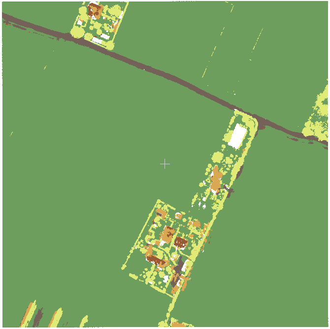
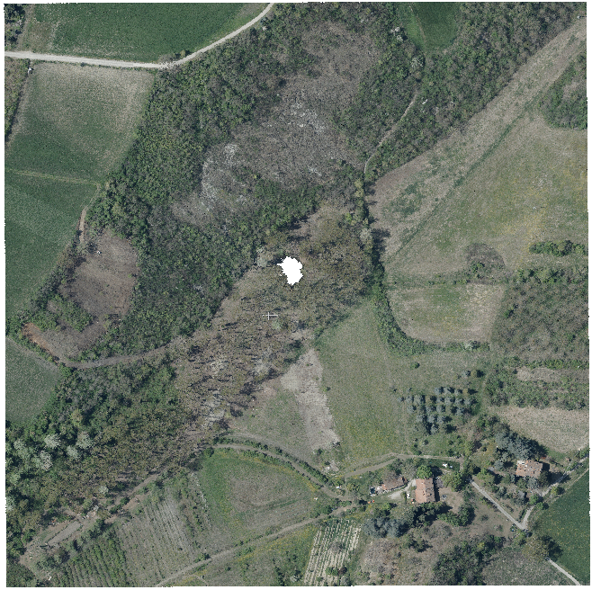
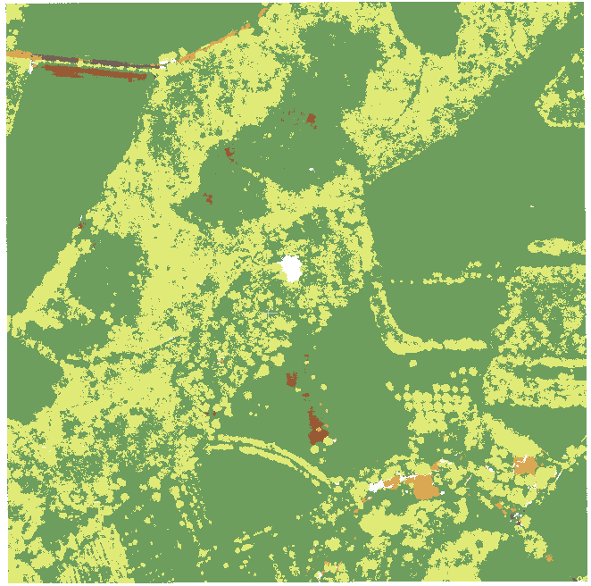
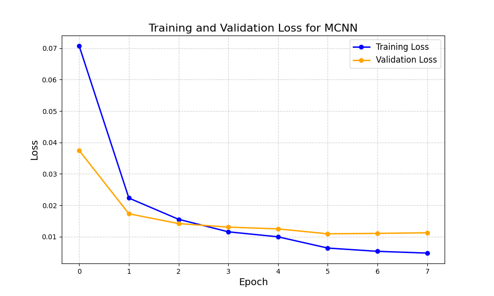

# Multi-Scale Convolutional Neural Network (MCNN) Training Project

This project contains the implementation of a Multi-Scale Convolutional Neural Network (MCNN) for the classification of LiDAR cloud data and generating corresponding images, based on the methodologies described in the articles "Segmentation and Multi-Scale Convolutional Neural Network-Based Classification of Airborne Laser Scanner Data" (2018) - at https://www.mdpi.com/1424-8220/18/10/3347 - and "A Convolutional Neural Network-Based 3D Semantic Labeling Method for ALS Point Clouds" (2017) at https://www.mdpi.com/2072-4292/9/9/936. 

## Table of Contents
- Installation
- Usage
- Structure

## Installation

To set up the environment and install the required dependencies, it's recommended to use Conda. Follow these steps:
1. **Clone this repository**:

```bash
git clone https://github.com/MatteoFalcioni/MCNN.git
cd MCNN
```

2. **Create a new Conda environment and install dependencies:**:

```bash
conda env create -f environment.yml
conda activate CNNLidar
```

# Usage

## Model training

To train the MCNN model with default settings, you should only specify the file path to the file you want to train on through the `--training_data_filepath` command line argument:

```bash
python main.py --training_data_filepath <path_to_training_file>
```
The training file can be in `.las` or `.csv` format.

To train the MCNN model with custom setting, you can use the argument parser to specify relevant command line arguments. The possible commands are:
 
- `--batch size`  specifies batch size for training
- `--epochs` specifies the number of training epochs
- `--patience` specifies the number of epochs to wait for an improvement in validation loss before early stopping
- `--learning_rate` specifies the learning rate for the optimizer
- `--learning_rate_decay_epochs` specifies the epochs interval to decay learning rate 
- `--learning_rate_decay_factor` specifies the learning rate decay factor
- `--momentum` specifies the value of momentum to be used in the scheduler
- `--num_workers` specifies the number of workers to be used from the PyTorch dataloader for parallel processing
- `--features_to_use` specifies the selected features from the data that should be used for the feature images generation. For example, a valid argument could be `--features_to_use intensity red green blue`
- `--window sizes` specifies the chosen window sizes of the feature images, in meters. For example, a valid argument could be `--window sizes 2.5 5.0 10.0`
- `save_model` specifies if the model should be saved or discarded. Default is True
- `model_save_dir` specifiying the directory where the model should be saved. . The default directory is `models/saved/`
- `--dataset_filepath` allows you to specify the path to a bigger dataset file, for which training and evaluation files are subsets. This is useful if you want to generate feature images only for a subset of the full dataset, while still using all points for nearest neighbor feature assignment.

If you save the model, it will be saved as a `.pth` file that can be loaded later on for evaluation or for predictions.
In the same folder, the code will automatically save the files:
- `features_used.csv`, containing the used feature during training;
- `hyperparameters.csv`, containing the hyperparameters used for training;
- `MCNN_loss_plot_<timestamp>.png`, plotting the loss function for the completed training.


You can find all default values of the command line arguments inside the `config.yaml` file.


## Model evaluation
You can evaluate a model performance by specifying other command line arguments. 
First of all, if you want to evaluate the model directly after training, you can add to the training command line the argument `--evaluate_model_after_training` if you want to perform the evaluation right after training is completed. 
This argument should be followed by the argument `--evaluation_data_filepath` specifying the filepath to the file you want on which you want to evaluate the model. 
For example:
```bash
python main.py <other_command_line_arguments> --evaluate_model_after_training --evaluation_data_filepath <path_to_your_test_file>
```
Otherwise, you can evaluate model independently from training by specifying it in the command line with the argument `--perform_evaluation` and specifying the path to the model you want to evaluate with the argument `--load_model_filepath <path_to_the_model>`. 
For example:
```bash
python main.py --perform_evaluation --load_model_filepath <path_to_the_model>
```
In both cases, a folder `inference_<timestamp>` will be created inside the model folder, containing the files
- `classification_report.csv` with the classification report;
- `confusion_matrix.png` with the confusion matrix;
- `inference_log.txt` specifying which file the model was evaluated on.

## Model predictions
You can use the trained models to predict labels for your point cloud data. 
In order to do so, you must specify from command line the file path to the model you want to use for predictions with `--load_model_filepath <filepath_to_model>`, and the arguments `--predict_labels` and `--file_to_predict <path_to_las_file_to_predict>`, with the file path to the file whose labels you want to predict. 
This file must be in `.las` format.
For example:  
```bash
python main.py --load_model_filepath --predict_labels --file_to_predict <path_to_las_file_to_predict>
```

Since this model is computationally expensive (it requires the creation of 3 multi-channel feature images for each point-cloud point) the code will automatically check the input file size and, if it's retained too big to be processed in one go, it will be automatically split into subtiles, each of which will be then processed. 
Once the process is over, the subtiles will be stitched together to form the final output file, which will be saved inside the loaded model folder, in a `predictions/` subfolder. 

# Structure
The code is subdivided in 4 main modules: 
- the `models/` folder:
  this contains all code related to the netowrks' architecture, along with the saved pre-trained models inside its `saved/` subfolder;
- the `scripts/` folder:
  this module contains all relevant scripts to generate feature images from the point cloud data, train the model, evaluate it and run predictions; 
- the `utils/` folder: 
  contains all utilities needed for training and data pre-processing, along with the scripts needed to handle the configuration parameters;
- the `tests/` folder: 
  containing all the tests for the code.

Outside of these folders you can find the `main.py` script, which is the core script of the code, handling training/evaluation/prediction based on the specified command line arguments, as described above. 

You can also find the default command line parameters inside the `config.yaml` file, and the depencies for the conda environment inside `environment.yml`. 

The `vectorization_tries/` folder contains gpu accelerated versiions of the code, which resulted less efficient compared to the CPU multi-processing implementation. 

# MCNN Results

In the following we show some results of the MCNN classificator on the tiles of Bolgona's LiDAR Dataset. On the left, the images show the point clouds in RGB values. On the right, the predicted labels. Buildings are orange, Grass is green, High Vegetation is yellow, Railway is brown, Roads are grey and Cars are white.

<div style="display: flex; justify-content: space-evenly;">
  <figure style="margin: 0 10px;">
    
    
  </figure>
  <figure style="margin: 0 10px;">
    
    
  </figure>
</div>

<div style="display: flex; justify-content: space-evenly;">
  <figure style="margin: 0 10px;">
    
    
  </figure>
  <figure style="margin: 0 10px;">
    
    
  </figure>
</div>

Here is a visualization of the confusion matrix for the best trained model, evaluated on the evaluation dataset:


Finally, below is a plot of the training and validation losses:




